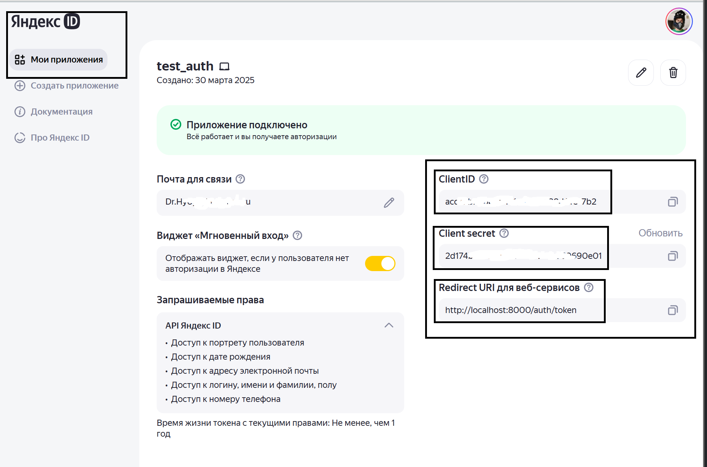

# Для запуска нужно:

1. Склонировать репозиторий к себе на сервер или компьютер
2. Создайте или переименуйте файл `.env` и заполните переменные `YANDEX_CLIENT_ID` `YANDEX_CLIENT_SECRET`из вашего YandexID
3. Настроить в YandexID "Redirect URI для веб-сервисов" на `http://localhost:8000/auth/token` 
4. Для локального запуска параметры можно оставить без изменений, но если у вас есть домен, указать его вместо localhost
5. Из корня проекта запустить контейнеры командой
```docker-compose up -d```
6. После нужно будет получить токен на главной странице через учетку Яндекс
7. Через сваггер или curl запрос с полученым токеном можно создать таблицы в БД по эндпоинту/ручке/вьюхе http://localhost:8000/create_db
8. Можно пользоваться, что бы остановить используем следущую команду
```docker-compose down```

## Пример работы можно посмотреть на сайте https://drhy6yc.ru/